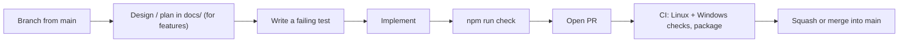

# Contributing to TimeLens

TimeLens is a Manifest V3 Chrome extension with no build step and no runtime npm dependencies. Node.js 22+ is only used for tests, validation, and packaging.

## Quick start

```bash
git clone https://github.com/mrprohack/TimeLens.git
cd TimeLens
npm run check      # tests + extension validator
```

Load the repository root as an unpacked extension at `chrome://extensions` (Developer mode → **Load unpacked**). Reload the extension after editing files.

## Where things go

| You are changing… | Put it in… | Test it in… |
| --- | --- | --- |
| Pure policy/timing logic (no `chrome.*`) | `src/core/` | `tests/core/` |
| Service worker, storage, migrations | `src/background/` | `tests/background/` |
| A page (popup, side panel, dashboard, blocked, onboarding) | `src/<page>/` | `tests/ui/` |
| Shared UI helpers or design tokens | `src/shared/` | `tests/ui/` |
| Manifest, permissions, CI, packaging, security contracts | `manifest.json`, `.github/`, `scripts/` | `tests/release/` |
| A design spec or implementation plan | `docs/design/`, `docs/plans/` | — |

Rules of thumb:

- Keep `chrome.*` calls out of `src/core/` so the logic stays unit-testable.
- Every runtime file must be local. The validator rejects `fetch`, `XMLHttpRequest`, remote scripts, `eval`, and `new Function`.
- Do not add permissions. `scripts/validate-extension.mjs` enforces the exact allowlist.
- Name test files `<module>.test.js`. `npm test` picks up every `tests/**/*.test.js` automatically.

## Workflow



### 1. Branch

Always branch from an up-to-date `main`:

| Prefix | Use for | Example |
| --- | --- | --- |
| `feat/` | New user-facing features | `feat/premium-dashboard-v1.5` |
| `fix/` | Bug fixes | `fix/midnight-split` |
| `design/` | Design specs and plans only | `design/simple-home-v1.4` |
| `docs/` | Documentation only | `docs/contributing` |
| `chore/` | Tooling, CI, repo structure | `chore/folder-structure` |

### 2. Commit

Use [Conventional Commits](https://www.conventionalcommits.org/): `<type>: <short imperative summary>`.

| Type | Meaning |
| --- | --- |
| `feat` | New behaviour |
| `fix` | Bug fix |
| `test` | Add or change tests only |
| `docs` | Documentation only |
| `style` | Visual/CSS or formatting, no logic change |
| `refactor` | Code change with no behaviour change |
| `security` | Hardening or a security fix |
| `ci` | GitHub Actions changes |
| `chore` | Tooling, dependencies, repo housekeeping |
| `release` | Version bumps and release artifacts |

Examples from history: `feat: add focus presets`, `fix: polish compact limit action menus`, `release: bump TimeLens to 1.4.0`.

### 3. Verify locally

```bash
npm test             # all unit and contract tests
npm run validate     # manifest, permissions, syntax, no remote code
npm run check        # both of the above (CI runs this)
npm run package      # builds dist/timelens-<version>.zip
```

Packaging uses a built-in zip writer, so it works on Windows, macOS, and Linux without a system `zip` binary.

### 4. Open a pull request

Fill in the PR template. CI must pass on both Ubuntu and Windows before merging.

## Releasing

1. Bump `version` in **both** `manifest.json` and `package.json` (the validator fails on a mismatch).
2. Update the version assertions in `tests/release/release.test.js`.
3. Add a section at the top of `CHANGELOG.md`.
4. Commit as `release: bump TimeLens to X.Y.Z` and open a PR.
5. After merging, CI on `main` uploads `timelens-X.Y.Z` as a workflow artifact. Download it and upload it to the Chrome Web Store.

## Security

Report vulnerabilities privately as described in [SECURITY.md](SECURITY.md). Do not open public issues for them.
